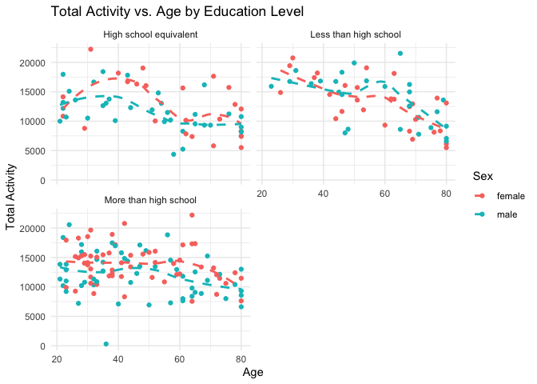
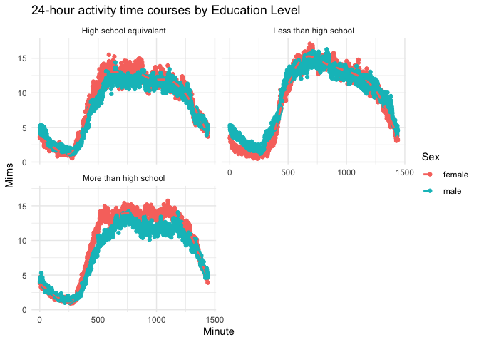

p8105_hw3_sc5078
================
Yvonne Chen
2023-10-14

# Problem 0

``` r
library(tidyverse)
```

    ## ── Attaching core tidyverse packages ──────────────────────── tidyverse 2.0.0 ──
    ## ✔ dplyr     1.1.2     ✔ readr     2.1.4
    ## ✔ forcats   1.0.0     ✔ stringr   1.5.0
    ## ✔ ggplot2   3.4.2     ✔ tibble    3.2.1
    ## ✔ lubridate 1.9.2     ✔ tidyr     1.3.0
    ## ✔ purrr     1.0.1     
    ## ── Conflicts ────────────────────────────────────────── tidyverse_conflicts() ──
    ## ✖ dplyr::filter() masks stats::filter()
    ## ✖ dplyr::lag()    masks stats::lag()
    ## ℹ Use the conflicted package (<http://conflicted.r-lib.org/>) to force all conflicts to become errors

``` r
library(ggridges)
library(patchwork)


library(p8105.datasets)
```

# Problem 1

load the dataset, instacart

``` r
data("instacart")
```

This dataset comprises 1384617 rows and 15 columns. Each row corresponds
to a single product within an Instacart order. The variables encompass
user, order, and product identifiers, as well as the order placement
sequence. Order-level attributes include details about the order’s day,
time, and days since the previous order. Additionally, item-specific
characteristics cover the product name (e.g., Yogurt, Avocado),
department (e.g., dairy and eggs, produce), aisle (e.g., yogurt, fresh
fruits), and whether the item has been previously ordered by the user.
In total, there are 39123 distinct products found in 131209 unique
orders placed by 131209 different users.

This is a table summarizing the number of items ordered from aisle. In
total, there are 134 aisles, with fresh vegetables being the most items
ordered by far.

``` r
instacart |> 
  count(aisle) |> 
  arrange(desc(n))
```

    ## # A tibble: 134 × 2
    ##    aisle                              n
    ##    <chr>                          <int>
    ##  1 fresh vegetables              150609
    ##  2 fresh fruits                  150473
    ##  3 packaged vegetables fruits     78493
    ##  4 yogurt                         55240
    ##  5 packaged cheese                41699
    ##  6 water seltzer sparkling water  36617
    ##  7 milk                           32644
    ##  8 chips pretzels                 31269
    ##  9 soy lactosefree                26240
    ## 10 bread                          23635
    ## # ℹ 124 more rows

The plot shows the number of items ordered in each aisle, limiting this
to aisles with more than 10000 items ordered.

``` r
instacart |> 
  count(aisle) |> 
  filter(n > 10000) |> 
  mutate(aisle = fct_reorder(aisle, n)) |> 
  ggplot(aes(x = aisle, y = n)) + 
  geom_point() + 
  labs(title = "Number of items ordered in each aisle") +
  theme(axis.text.x = element_text(angle = 60, hjust = 1))
```

<!-- -->

This is a table showing the three most popular items in each of the
aisles “baking ingredients”, “dog food care”, and “packaged vegetables
fruits”.

``` r
instacart |> 
  filter(aisle %in% c("baking ingredients", "dog food care", "packaged vegetables fruits")) |>
  group_by(aisle) |> 
  count(product_name) |> 
  mutate(rank = min_rank(desc(n))) |> 
  filter(rank < 4) |> 
  arrange(desc(n)) |>
  knitr::kable()
```

| aisle                      | product_name                                  |    n | rank |
|:---------------------------|:----------------------------------------------|-----:|-----:|
| packaged vegetables fruits | Organic Baby Spinach                          | 9784 |    1 |
| packaged vegetables fruits | Organic Raspberries                           | 5546 |    2 |
| packaged vegetables fruits | Organic Blueberries                           | 4966 |    3 |
| baking ingredients         | Light Brown Sugar                             |  499 |    1 |
| baking ingredients         | Pure Baking Soda                              |  387 |    2 |
| baking ingredients         | Cane Sugar                                    |  336 |    3 |
| dog food care              | Snack Sticks Chicken & Rice Recipe Dog Treats |   30 |    1 |
| dog food care              | Organix Chicken & Brown Rice Recipe           |   28 |    2 |
| dog food care              | Small Dog Biscuits                            |   26 |    3 |

This is a table showing the mean hour of the day at which Pink Lady
Apples and Coffee Ice Cream are ordered on each day of the week.

``` r
instacart |>
  filter(product_name %in% c("Pink Lady Apples", "Coffee Ice Cream")) |>
  group_by(product_name, order_dow) |>
  summarize(mean_hour = mean(order_hour_of_day)) |>
  pivot_wider(
    names_from = order_dow, 
    values_from = mean_hour) |>
  knitr::kable(digits = 2)
```

    ## `summarise()` has grouped output by 'product_name'. You can override using the
    ## `.groups` argument.

| product_name     |     0 |     1 |     2 |     3 |     4 |     5 |     6 |
|:-----------------|------:|------:|------:|------:|------:|------:|------:|
| Coffee Ice Cream | 13.77 | 14.32 | 15.38 | 15.32 | 15.22 | 12.26 | 13.83 |
| Pink Lady Apples | 13.44 | 11.36 | 11.70 | 14.25 | 11.55 | 12.78 | 11.94 |

# Problem 2

load the dataset, BRFSS

``` r
data("brfss_smart2010")
```

data cleaning

``` r
brfss_smart2010 = brfss_smart2010 |>
  janitor::clean_names()|>
  filter(topic %in% "Overall Health") |>
  filter(response %in% c("Excellent", "Very good", "Good", "Fair", "Poor")) |>
  mutate(response = ordered(response, levels=c("Poor", "Fair", "Good", "Very good", "Excellent"))) |>
  arrange(response)
```

List of states were observed at 7 or more locations in year 2002 and
2010.

``` r
brfss_smart2010 |>
  filter(year %in% c(2002, 2010)) |>
  group_by(year, locationabbr) |>
  filter(n_distinct(locationdesc) >= 7) |>
  summarize()
```

    ## `summarise()` has grouped output by 'year'. You can override using the
    ## `.groups` argument.

    ## # A tibble: 20 × 2
    ## # Groups:   year [2]
    ##     year locationabbr
    ##    <int> <chr>       
    ##  1  2002 CT          
    ##  2  2002 FL          
    ##  3  2002 MA          
    ##  4  2002 NC          
    ##  5  2002 NJ          
    ##  6  2002 PA          
    ##  7  2010 CA          
    ##  8  2010 CO          
    ##  9  2010 FL          
    ## 10  2010 MA          
    ## 11  2010 MD          
    ## 12  2010 NC          
    ## 13  2010 NE          
    ## 14  2010 NJ          
    ## 15  2010 NY          
    ## 16  2010 OH          
    ## 17  2010 PA          
    ## 18  2010 SC          
    ## 19  2010 TX          
    ## 20  2010 WA

Construct a dataset, excellent, that is limited to Excellent responses,
and contains, year, state, and a variable that averages the data_value
across locations within a state. This is a “spaghetti” plot of this
average value over time within a state.

``` r
excellent <- brfss_smart2010 |>
  filter(response %in% "Excellent") |>
  group_by(year, locationabbr) |>
  mutate(
    average_data = mean(data_value)
  ) |>
  summarize(year, average_data)
```

    ## Warning: Returning more (or less) than 1 row per `summarise()` group was deprecated in
    ## dplyr 1.1.0.
    ## ℹ Please use `reframe()` instead.
    ## ℹ When switching from `summarise()` to `reframe()`, remember that `reframe()`
    ##   always returns an ungrouped data frame and adjust accordingly.
    ## Call `lifecycle::last_lifecycle_warnings()` to see where this warning was
    ## generated.

    ## `summarise()` has grouped output by 'year', 'locationabbr'. You can override
    ## using the `.groups` argument.

``` r
ggplot(excellent, aes(x = year, y = average_data, color = locationabbr)) +
  geom_line()  +
  labs(title = "Average Value Over Time within a State",
       x = "Year",
       y = "Average Value",
       color = "State") + 
  theme_minimal()
```

    ## Warning: Removed 65 rows containing missing values (`geom_line()`).

<!-- -->

There is a two-panel plot showing, for the years 2006, and 2010,
distribution of data_value for responses (“Poor” to “Excellent”) among
locations in NY State.

``` r
brfss_smart2010 |>
  filter(year %in% c(2006, 2010)) |>
  filter(locationabbr %in% "NY") |>
  ggplot(aes(x = response, y = data_value, fill = response)) +
  geom_boxplot() +
  facet_wrap(~year, nrow = 1) +
  labs(title = "Distribution of Data Value for Responses in NY State",
       x = "Response",
       y = "Data Value") +
  theme_minimal()
```

<!-- -->

# Problem 3

Load and tidy dataset, nhanes_accel

``` r
nhanes_accel = read.csv("./data/nhanes_accel.csv") |>
  janitor::clean_names()|>
  pivot_longer(
    min1:min1440,
    names_to = "minute", 
    names_prefix = "min",
    values_to = "mims") |>
  mutate(
    minute = as.numeric(minute),
    mims = as.numeric(mims)
  )
```

Load and tidy dataset, nhanes_covar

``` r
nhanes_covar = read.csv("./data/nhanes_covar.csv", skip = 4) |>
  janitor::clean_names()|>
  na.omit() |>
  filter(age >= 21) |>
  mutate(
    sex = 
      case_match(
        sex, 
        1 ~ "male", 
        2 ~ "female"), 
    sex = as.factor(sex),
    education =
      case_match(
        education,
        1 ~ "Less than high school",
        2 ~ "High school equivalent",
        3 ~ "More than high school"
      ),
    education = as.factor(education)
  )
```

Merge nhanes_accel and nhanes_covar into nhanes

``` r
nhanes = 
  left_join(nhanes_covar, nhanes_accel, by = "seqn")
```

This is a reader-friendly table for the number of men and women in each
education category.

``` r
nhanes |>
  group_by(sex, education)|>
  summarize(n_obs = n_distinct(seqn))|>
  pivot_wider(
    names_from = education,
    values_from = n_obs
  )|>
  knitr::kable()
```

    ## `summarise()` has grouped output by 'sex'. You can override using the `.groups`
    ## argument.

| sex    | High school equivalent | Less than high school | More than high school |
|:-------|-----------------------:|----------------------:|----------------------:|
| female |                     23 |                    28 |                    59 |
| male   |                     35 |                    27 |                    56 |

There are more male having high school equivalent education level than
female. There are more female have less than high school education or
more than high school education than male. For both male and female,
most of people having more than high school education.

Create a visualization of the age distributions for men and women in
each education category.

``` r
nhanes |>
  group_by(education, sex) |>
  ggplot(aes(x = education, y = age, fill = sex)) +
  geom_boxplot() +
  labs(title = "Age Distributions by Education Category",
       x = "Education Category",
       y = "Age",
       fill = "Sex")
```

<!-- -->

The age distribution between female and male is similar in the “less
than high school” and “More than high school” education group. However,
for the “High school equivalent” education level, females would have a
higher maximum age, minimum age, and average age than males. For
females, “High school equivalent” education level has the highest mean
age, 57.39, while “More than high school” education level has the lowest
mean age, 45.68. For males, “Less than high school” have the highest
mean age, 57.22, while “More than high school” education level has the
lowest mean age, 46.61.

Aggregate across minutes to create a total activity variable for each
participant. Plot these total activities (y-axis) against age (x-axis).

``` r
nhanes |>
  group_by(seqn, age, sex, education) |>
  summarize(total_activity = sum(mims)) |>
  ggplot(aes(x = age, y = total_activity, color = sex)) +
  geom_point() +
  geom_smooth(se = FALSE, aes(group = sex), linetype = 2) +
  facet_wrap(~ education, nrow = 2) +
  labs(title = "Total Activity vs. Age by Education Level",
       x = "Age",
       y = "Total Activity",
       color = "Sex") +
  theme_minimal()
```

    ## `summarise()` has grouped output by 'seqn', 'age', 'sex'. You can override
    ## using the `.groups` argument.
    ## `geom_smooth()` using method = 'loess' and formula = 'y ~ x'

<!-- -->

Make a three-panel plot that shows the 24-hour activity time courses for
each education level and use color to indicate sex. Describe in words
any patterns or conclusions you can make based on this graph; including
smooth trends may help identify differences.

``` r
nhanes |>
  group_by(sex, education, minute) |>
  summarise(mims_mean = mean(mims)) |>
  ggplot(aes(x = minute, y = mims_mean, color = sex)) +
  geom_point() +
  geom_smooth(se = FALSE, aes(group = sex), linetype = 2) +
  facet_wrap(~ education, nrow = 2) +
  labs(title = "24-hour activity time courses by Education Level",
       x = "Minute",
       y = "Mims",
       color = "Sex") +
  theme_minimal()
```

    ## `summarise()` has grouped output by 'sex', 'education'. You can override using
    ## the `.groups` argument.
    ## `geom_smooth()` using method = 'gam' and formula = 'y ~ s(x, bs = "cs")'

<!-- -->
